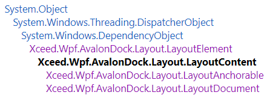
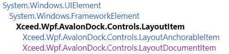
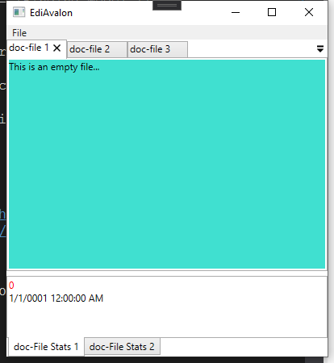
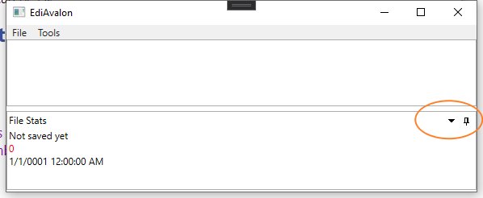

# A demo to learn AvalonDock (accompanied by Stylet)

## Tutorials
Mainly follow the tutorials listed at https://github.com/Dirkster99/AvalonDock, but try to simplify it with the dedicated MVVM framework *Stylet*.

Documentation of Avalon dock can be found [here](https://doc.xceed.com/xceed-toolkit-plus-for-wpf/Xceed.Wpf.AvalonDock.html).

## Required NuGet Packages
- Dirkster.AvalonDock
- Stylet
- Template [Stylet.Templates.VM](https://www.nuget.org/packages/Stylet.Templates.VM/) to generate a Stylet project quickly by 
    ```
    dotnet new stylet.vm -n EdiAvalon
    ```
- Better set up the [props.snippet](https://gist.github.com/ShuhuaGao/bff38344143717ace1a468c78efcf338) to generate quickly a property that notifies its change in `Stylet`.

## Some explanations
### A bird's eye view of the MVVM approach for Avalon dock
The viewmodel (i.e., a data object) is assigned to the `Content` of a `LayoutConent`



A instance of `LayoutAnchorable` or `LayoutDocument` is placed in a pane on the layout side of Avalon dock. On the control side, a `LayoutAnchorable` or `LayoutDocument` object is presented by a `LayoutItem`.



- The visualization of the data object (a viewmodel) is done according to data template.
- The appearance of a `LayoutItem` is customized with a `Style`. See `LayoutItemContainerStyle` and `LayoutItemContainerStyleSelector`.
- A `AvalonDock.Layout.LayoutDocumentPane` can contain multiple `LayoutDocument` or `LayoutAnchorable`, but a `LayoutAnchorablePane` can only accommodate multiple `LayoutAnchorable`.


### Two key classes: `LayoutAnchorable` and `LayoutDocument`
Both classes derive from `LayoutContent`, whose `ContentProperty` is `Content`. Thus, we may use the two classes as a `ContentControl`, whose `Content` can be anything (i.e., a `Control` or any data object). If a data object is supplied, then it is visualized with a data template if applicable.

Note that `LayoutElement` inherits `System.Windows.DependencyObject` and is NOT a `Control`. That is why classes in the `AvalonDock.Layout` namespace are considered to be *models* (distinct from the model in MVVM though).

### How to render a data object (viewmodel) in Avalon dock?
The data object may be placed statically and explicitly inside `LayoutDocument` or `LayoutAnchorable` in XAML, or assigned implicitly in data source.
- A simple way: define an **automatically applied** `DataTemplate` for the given viewmodel type. See [this commit](https://github.com/ShuhuaGao/WPF-Examples/tree/668e3099bcd7b5959ffd1dd1491a6f7a657b72e5/Control3rdParty/EdiAvalon). Note that `LayoutElement` has no template property since it is not a control.
    ```xml
    <Window.Resources>
        <DataTemplate DataType="{x:Type vm:FileViewModel}">
            <TextBlock Background="Turquoise" Text="{Binding TextContent}" />
        </DataTemplate>
    </Window.Resources>
    ...
    <ad:DockingManager x:Name="dockManager">
        <ad:LayoutRoot>
            <ad:LayoutPanel>
                <ad:LayoutDocumentPane>
                    <!-- `Content` refers to the `FileViewModel` instance below -->
                    <ad:LayoutDocument Title="{Binding RelativeSource={RelativeSource Self}, Path=Content.Title}" CanFloat="False">
                        <!-- rendered by the DataTemplate in Window.Resources -->
                        <vm:FileViewModel />
                    </ad:LayoutDocument>
                </ad:LayoutDocumentPane>
            </ad:LayoutPanel>
        </ad:LayoutRoot>
    ```


### Get the currently active content (usually a viewmodel)
- `DockingManager.ActiveContent: object` and its event 
    ```csharp
    public object ActiveContent {get; set;}
    public event EventHandler ActiveContentChanged
    ```
    Note that the `ActiveContent` actually refers to the underlying viewmodel in a pane.
- It is common that the active content (i.e., a visual pane) is chosen by the user and changed frequently. Besides, multiple objects may need to know the `ActiveContent`, e.g., other `LayoutContent`s. Nonetheless, we can only set up one source for `ActiveContent` binding.
- To allow the information propagation to multiple objects, we may use a global *broker* or use the event mechanism (i.e., listening on `ActiveContentChanged`) in an event aggregator.

### How to create panes dynamically
In practice, the number of panes and their layout are not fixed, e.g., a user may *new* a document in need. That is, we cannot pre-specify the layout in XAML.

In a MVVM setting, the collections of document and anchorable viewmodels (data objects) are provided to `DockingManager` with the following [two dependency properties](https://doc.xceed.com/xceed-toolkit-plus-for-wpf/Xceed.Wpf.AvalonDock~Xceed.Wpf.AvalonDock.DockingManager_members.html):
```csharp
public IEnumerable DocumentsSource {get; set;}
public IEnumerable AnchorablesSource {get; set;}
```
We can thus bind the above two properties to `ObservableCollection` of viewmodels (here each viewmodel means a data object of a `LayoutContent`).

Note that at least one (empty) `LayoutDocumentPane` and `LayoutAnchorablePane` should be specified for visualization of data objects in the two sources.


### How to set the style of a pane
Now since the `LayoutItem, LayoutAnchorableItem, LayoutDocumentItem` (backed by `LayoutContent` and subclasses) are produced dynamically, we can use style to customize its appearance. 

The `Style` is applied to `LayoutItem` that inherits `FrameworkElement`. `LayoutItem` has a [`Model`](https://doc.xceed.com/xceed-toolkit-plus-for-wpf/Xceed.Wpf.AvalonDock~Xceed.Wpf.AvalonDock.Controls.LayoutItem~Model.html) property that gets the content of the associated LayoutAnchorable or LayoutDocument. Thus, `Model` refers actually to our data object and can be used in binding inside the Style.

- A simple case: a [fixed style](https://doc.xceed.com/xceed-toolkit-plus-for-wpf/Xceed.Wpf.AvalonDock~Xceed.Wpf.AvalonDock.DockingManager~LayoutItemContainerStyle.html) for all `LayoutItem`
```csharp
public Style LayoutItemContainerStyle {get; set;}
```

```xml
<ad:DockingManager x:Name="dockManager"
                   AnchorablesSource="{Binding Tools}"
                   DocumentsSource="{Binding Files}">
    <ad:DockingManager.LayoutItemContainerStyle>
        <Style TargetType="{x:Type ad:LayoutItem}">
            <!-- property Model of LayoutItem is the data object -->
            <Setter Property="Title" Value="{Binding Model.Title, StringFormat=doc-\{0\}}" />
        </Style>
    </ad:DockingManager.LayoutItemContainerStyle>
    <ad:LayoutRoot>
        <ad:LayoutPanel Orientation="Vertical">
            <ad:LayoutDocumentPane />
            <ad:LayoutAnchorablePane DockMinHeight="100" />
        </ad:LayoutPanel>
    </ad:LayoutRoot>
</ad:DockingManager>
```

Check [this commit](https://github.com/ShuhuaGao/WPF-Examples/tree/ca3012038f6ff0f411997e1d6bd890377423cf91/Control3rdParty/EdiAvalon) for the above test.



- Use a `StyleSelector` to customize the `LayoutItem` appearance for various data objects. That is, choose the style of the `LayoutItem` based on its viewmodel underneath by making use the `DockingManager.LayoutItemContainerStyleSelector` property.
    ```csharp
    public StyleSelector LayoutItemContainerStyleSelector {get; set;}
    ```

    We need to provide a subclass of `System.Windows.Controls.StyleSelector`. Check [LayoutItemContainerStyleSelector.cs](./Views/ADSelectors/LayoutItemContainerStyleSelector.cs) and the associated XAML file for an example.

### Customize the header of a pane
Set `DockingManager.AnchorableHeaderTemplate` or `DockingManager.DocumentHeaderTemplate`.
```xml
<ad:DockingManager.AnchorableHeaderTemplate>
    <DataTemplate>
        <StackPanel Orientation="Horizontal">
            <Image Margin="0,0,4,0"
                    MaxHeight="20"
                    MaxWidth="20"
                    Source="{Binding IconSource}" />
            <TextBlock Text="{Binding Title}" />
        </StackPanel>
    </DataTemplate>
</ad:DockingManager.AnchorableHeaderTemplate>
```
The binding source (data context) seems to be a `LayoutAnchorable`. 

Check Commit c5613a20 for details.


### Active content
The currently active data object can be obtained (bound) by `DockingManager.ActiveContent`, which may be any object hosted in both `LayoutAnchorable` and `LayoutDocument` in an active `LayoutItem`.

To filter the active content, e.g., if we only care about the active document object, we can set up a converter for the binding (or alternatively, use an `object` property as the source and do logic therein).

Check [ActiveDocumentConverter.cs](./Converters/ActiveDocumentConverter.cs).
```xml
ActiveContent="{Binding ActiveDocument, Mode=TwoWay, Converter={StaticResource activeDocumentConverter}}"
```

### Open a file dialog in MVVM
Refer to https://stackoverflow.com/a/64861760


### Visibility of `LayoutItem`
`LayoutItem` inherits the `Visibility` property from `UIElement`. The `System.Windows.Visibility` enum has three values:
```
Collapsed	2	
Do not display the element, and do not reserve space for it in layout.

Hidden	1	
Do not display the element, but reserve space for the element in layout.

Visible	0	
Display the element.
```
We usually define a `bool` property in the viewmodel instead and perform conversion between the two in binding.

Avalon dock has provided a built-in converter as `AvalonDock.Converters.BoolToVisibilityConverter`. Since a `false` may be interpreted as either `Collapsed` or `Hidden`, we indicate our choice as the converter parameter.

```xml
<Setter Property="Visibility" Value="{Binding Model.IsVisible, Converter={StaticResource boolToVisibilityConverter}, ConverterParameter={x:Static Visibility.Hidden}, Mode=TwoWay}" />
```

The `ViewModel.IsVisible` can then be manipulated by a control like a menu item. 

- Note that if the converter parameter is set to `Visibility.Collapsed` instead, then once the tool pane is closed, we cannot use `IsVisibile = true` to show it again. 
- The [`CanClose`](https://doc.xceed.com/xceed-toolkit-plus-for-wpf/Xceed.Wpf.AvalonDock~Xceed.Wpf.AvalonDock.Controls.LayoutItem~CanClose.html) property of a `LayoutItem` should be `false` (by default). Otherwise, 
    > Gets or sets whether the content can be closed definitively (removed from the layout and not just hidden).

  We cannot show it again. 

- To prohibit hiding, we set `<Setter Property="CanHide" Value="False"/>`. In this case, no x button is shown, since the item cannot be hidden or closed.
    