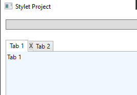
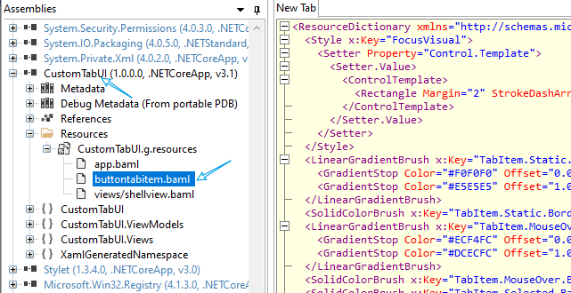

In [StyledTabUI](../StyledTabUI/), the `TabItem` are added directly (i.e., into the `Items` property of a `TabControl`). In this project, we play with the `ItemsSource`, which produce `TabItem` dynamically within an MVVM framework.


# Objective

## Header appearance
Mimic the tab style of VS.

1. If a tab item is selected or mouse over, change its header color.
2. If a tab item is selected or mouse over, show a close button that can be used to destroy the tab item. 

## Content
Defined by a `DataTemplate`

# Methodology 
## Customize header appearance with control template
Suppose we do not want to bind our new tab control to a fixed data source (viewmodel). We modify the appearance of a `TabItem` by adjusting its control template. 

- The new `TabItem` has a button in its header.
- How can we expose the button `Command` property such that a user can bind the Command freely? Use *attached property* to attach a new property to the `TabItem`. Otherwise, we have to create a new control by inheriting `TabItem`. References: [Extending WPF Control Templates with Attached Properties](https://markheath.net/post/wpf-templates-attached-properties)

### 1. Create a new `TabItem` style that adds a button to the control template

- In VS, add a *Resource dictionary* XAML file into the project.
- Copy the default `TabItem` style into the dictionary and add a button in the `Grid` part
```xml
<Style x:Key="ButtonTabItemStyle" TargetType="{x:Type TabItem}">
    ...
    <ControlTemplate TargetType="{x:Type TabItem}">
        <Grid x:Name="templateRoot" SnapsToDevicePixels="true">
            <Grid.ColumnDefinitions>
                <ColumnDefinition Width="*"/>
                <ColumnDefinition Width="auto"/>
            </Grid.ColumnDefinitions>
            <Border x:Name="mainBorder" Background="{TemplateBinding Background}" BorderThickness="1,1,1,0" BorderBrush="{TemplateBinding BorderBrush}" Margin="0">
                <Border x:Name="innerBorder" Background="{StaticResource TabItem.Selected.Background}" BorderThickness="1,1,1,0" BorderBrush="{StaticResource TabItem.Selected.Border}" Margin="-1" Opacity="0"/>
            </Border>
            <ContentPresenter x:Name="contentPresenter" ContentSource="Header" Focusable="False" HorizontalAlignment="{Binding HorizontalContentAlignment, RelativeSource={RelativeSource AncestorType={x:Type ItemsControl}}}" Margin="{TemplateBinding Padding}" RecognizesAccessKey="True" SnapsToDevicePixels="{TemplateBinding SnapsToDevicePixels}" VerticalAlignment="{Binding VerticalContentAlignment, RelativeSource={RelativeSource AncestorType={x:Type ItemsControl}}}"/>
            <Button x:Name="button" Content="X" BorderBrush="Transparent" Grid.Column="1"/>
        </Grid>
...
```
In the other view files, we may use the above resource and the style therein. E.g.,
```xml
<TabControl Grid.Row="1" Margin="10" Background="AliceBlue">
    <TabControl.Resources>
        <ResourceDictionary>
            <ResourceDictionary.MergedDictionaries>
                <ResourceDictionary Source="pack://application:,,,/ButtonTabItem.xaml"/>
            </ResourceDictionary.MergedDictionaries>
        </ResourceDictionary>
    </TabControl.Resources>
    <TabItem Header="Tab 1" Style="{StaticResource ButtonTabItemStyle}">
        <TextBlock>Tab 1</TextBlock>
    </TabItem>
    <TabItem Header="Tab 2">
        <Button Margin="20">Tab 2</Button>
    </TabItem>
</TabControl>
```
Note that, in the style resource, both the key and the `TargetType` are specified for the style. Consequently, the style will not be applied automatically. 


Obviously, in a serious tab control, we have to further refine the appearance especially those in `<ControlTemplate.Triggers>` to make the button better integrate into the header.
#### More about the resource dictionary file
In VS, the default build action for a resource dictionary file is `Page`. What does that mean? Lets' check [Build actions](https://docs.microsoft.com/en-us/visualstudio/ide/build-actions?view=vs-2019)
>Page	WPF	Compile a XAML file to a binary .baml file for faster loading at run time.

However, we did not see the .baml file. In fact,it has been compiled into the generated assembly "CustomTabUI.dll". We can inspect its content using ILSpy. 


Additionally, since the resource file has been compiled into the current assembly (*local assembly*), the pack URI is thus `pack://application:,,,/ButtonTabItem.xaml`, where the `pack://application:,,,` part is fixed for the local assembly. Check [Local Assembly Resource File](https://docs.microsoft.com/en-us/dotnet/desktop/wpf/app-development/pack-uris-in-wpf?redirectedfrom=MSDN&view=netframeworkdesktop-4.8#local-assembly-resource-file) for more details.

### 2. Expose the `Button.Command` via attached property
Though we have added a button into the control template,how can we access it outside the template? We generally need to bind some command to the button. 

**Control template cannot add any new property to the control.** We have to either inherit the control or set up some *attached property*. The latter seems simpler.

We create a class `AP` and define an attached property `CommandProperty` with some boilerplate code. The attached property will be used as `AP.Command`. Then, inside the control template, we bind the `AP.Command` property of `TabItem` to the internal button's `Command` (which is a dependency property and can act as the binding target).
```xml
<Button x:Name="button" Content="X" BorderBrush="Transparent" Grid.Column="1"
                                Command="{TemplateBinding local:AP.Command}"/>
```
>A TemplateBinding is an optimized form of a Binding for template scenarios, analogous to a Binding constructed with {Binding RelativeSource={RelativeSource TemplatedParent}, Mode=OneWay}. Links the value of a property in a control template to be the value of another property on the templated control.

Next, set the attached property to the `TabItem` using our new style as follows:
```xml
<TabItem Header="Tab 1" Style="{StaticResource ButtonTabItemStyle}" r:AP.Command="New">
    <TextBlock>Tab 1</TextBlock>
</TabItem>
```
The above "New" refers to the built-in command `ApplicationCommands.New`. For testing purposes, we install a `CommandBinding` to handle it 
```xml
    <Window.CommandBindings>
        <CommandBinding Command="New" CanExecute="CommandBinding_CanExecute" Executed="CommandBinding_Executed"/>
    </Window.CommandBindings>
```

#### More about attached property
In fact, we can attach a dependency property to any `DependencyObject` because the method signature is `public static void SetCommand(DependencyObject obj, ICommand value)`. For instance, we can also set the attached property for the second `TabItem` though it makes no sense (since it is never used).
```xml
<TabItem Header="Tab 2" r:AP.Command="Close">
    <Button Margin="20">Tab 2</Button>
</TabItem>
```


