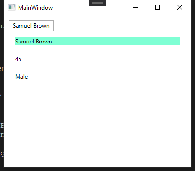
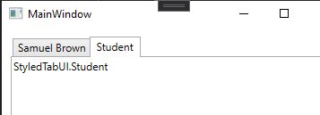
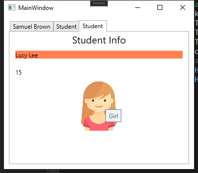

# Scenario
The number of tab pages is few and fixed. We know their forms in design time. We add `TabItem` directly in XAML. Let's suppose we have three pages: the first displays a `Teacher` and the latter two exhibit two `Student`s.

# Objective
1. When mouse moves over the header of a tab item, change its color (like VS).
2. On each student's page, display an image to show his/her sex.
2. Play with `DataTemplate` and `DataTrigger`.


In this example, we have back data (viewmodel) but, for simplicity, we do not use an MVVM framework and set the `DataContext` manually.

# Create object instances in XAML
Currently, the instances defined directly in XAML must have default constructor. We can set its properties though. The syntax is the same as other common types, like a `Control`.
```xml
<Window.Resources>
    <local:Teacher x:Key="teacher"/>
    <local:Student x:Key="stu1" Sex="Male" Age="14">
        <local:Student.Name>Jack Ma</local:Student.Name>
    </local:Student>
    <local:Student x:Key="stu2" Sex="Female" Age="15" Name="Lucy Lee"/>
</Window.Resources>
```
The class definitions are presented in [Data.cs](./Data.cs).

On the other hand, if the constructors do require arguments, we generally create them in the viewmodel (or, if proper, in the code-behind).
# TabControl
## Create a TabItem without using templates
A simple `TabItem` can be added directly. Recall that `TabControl` inherits `ItemsControl`.
```xml
<TabControl Margin="10">
    <TabItem DataContext="{StaticResource teacher}" Header="{Binding Name}">
        <!--TabItem inherits ContentControl. We set the content below-->
        <StackPanel>
            <TextBlock Text="{Binding Name}" Margin="10" Background="Aquamarine"/>
            <TextBlock Text="{Binding Age}" Margin="10"/>
            <TextBlock Text="{Binding Sex}" Margin="10"/>
        </StackPanel>
    </TabItem>
</TabControl>
```
which gives

Note that since each `TabItem` will consume different data, we set their `DataContext` separately.
## Create a TabItem with template
### A basic data template
Recall that, as a `HeaderedContentControl`, a `TabItem` has two data templates: `HeaderTemplate` and `ContentTemplate`. See [this doc](../readme.md) for details. In this part, we focus on its `ContentTempalte`.

Since the template is supposed to be used in multiple `TabItem`, it is better to make it a resource. Before that, let's first check the following XAML
```xml
<TabItem Header="Student" Content="{StaticResource stu1}"></TabItem>
```
The above code works because `TabItem` is a `ContentControl`. Since no data template is available, the `ContentPresenter` finally renders the content object using `ToString`.


Let's dress the data with a data template. Add a resource to `<Window.Resources>` (can be any accessible resource)
```xml
<DataTemplate x:Key="temp-stu">
    <StackPanel>
        <TextBlock FontSize="20" HorizontalAlignment="Center">Student Info</TextBlock>
        <TextBlock Text="{Binding Name}" Margin="10" Background="Coral"/>
        <TextBlock Text="{Binding Age}" Margin="10"/>
        <TextBlock Text="{Binding Sex}" Margin="10"/>
    </StackPanel>
</DataTemplate>
```
and
```xml
 <TabItem Header="Student" Content="{StaticResource stu1}" ContentTemplate="{StaticResource temp-stu}"></TabItem>
```
### An alternative usage of data template by specifying `DataType`
In the above code, we specify the template `ContentTemplate` directly. However, if many controls need such a template, it is may verbose to assign each. We can instead specify the data type for which the data template is designed, and that template is used automatically if an instance of such data type is to be rendered. This is achieved by [DataTemplate.DataType Property](https://docs.microsoft.com/en-us/dotnet/api/system.windows.datatemplate.datatype?view=net-5.0#System_Windows_DataTemplate_DataType).
>This property is very similar to the TargetType property of the Style class. When you set this property to the data type without specifying an x:Key, the DataTemplate gets applied automatically to data objects of that type. Note that when you do that the x:Key is set implicitly. Therefore, if you assign this DataTemplate an x:Key value, you are overriding the implicit x:Key and the DataTemplate would not be applied automatically.

Since a `DataTemplate` is usually defined as a resource, its scope conforms to that of a resource. Check [Static resource lookup behavior](https://docs.microsoft.com/en-us/dotnet/desktop/wpf/fundamentals/xaml-resources-define?view=netdesktop-5.0#static-resource-lookup-behavior). In short, as a common practice, the resource is found starting from the element itself and upward to its parents and finally within the application resources. That is, the automatic application of the data template applies to all children elements in need.

```xml
<DataTemplate DataType="{x:Type local:Student}">
...
</DataTemplate>
```
There is no need to specify the `ContentTemplate` for a `TabControl` now. Once its content is a `Student` object, the above template is taken automatically.

- A hidden advantage of specifying the `DataType` is that VS XAML designer gives better intellisense since it knows the exact data type.

## A data template with `DataTrigger`

Now we want to exhibit the `Sex` property as an image, i.e., a boy or a girl. In a data template, to customize the appearance according to the actual data value, we can resort to `DataTrigger`.
### Show an image with `Image` control
The simplest way is to specify the `Source` property of an `Image`, though it is not the best way due to memory issues (see [here](https://docs.microsoft.com/en-us/dotnet/desktop/wpf/controls/how-to-use-the-image-element?view=netframeworkdesktop-4.8)).
In WPF, uniform resource identifiers (URIs) are used to identify and load files in many ways. WPF adopts the *pack scheme* to define the URI. See [doc here](https://docs.microsoft.com/en-us/dotnet/desktop/wpf/app-development/pack-uris-in-wpf?redirectedfrom=MSDN&view=netframeworkdesktop-4.8).

In this example, we did not build the image files into the application (assembly) but leave them outside. We thus use a relative URI *Site of Origin Pack URIs* that is relative to the .exe. Besides, we need to set the property of the image in VS such that it can be copied to the output directory (i.e., the one containing the executable). Right click the image and **Property --> Copy if newer**. (The folder structure of the image is also built if it is not in the root directory, that is, the project directory.)

For instance, in this example, we have a sub-folder *img* that contains a *boy.png*. The relative pack URI is `pack://siteoforigin:,,,/img/boy.png`. The first part `pack://siteoforigin:,,,` is fixed and refers to the directory where the executable resides.


### Apply `DataTemplate.Triggers`
In short, given a `DataTrigger`, if its `Binding` value is equal to the given `Value`, then all its `Setters` will be applied. Each `Setter` has a `TargetName` to specify its target in the template.

Check the [Microsoft doc example](https://docs.microsoft.com/en-us/dotnet/api/system.windows.datatemplate.triggers?view=net-5.0#examples).

```xml
<DataTemplate DataType="{x:Type local:Student}">
    <StackPanel>
        <TextBlock FontSize="20" HorizontalAlignment="Center">Student Info</TextBlock>
        <TextBlock Text="{Binding Name}" Margin="10" Background="Coral"/>
        <TextBlock Text="{Binding Age}" Margin="10"/>
        <Image x:Name="imgSex" Width="100"/>
    </StackPanel>
    <DataTemplate.Triggers>
        <DataTrigger Binding="{Binding Sex}" Value="Male">
            <!--Collection: DataTrigger.Setters-->
            <Setter TargetName="imgSex" Property="Source" Value="pack://siteoforigin:,,,/img/boy.png"/>
            <Setter TargetName="imgSex" Property="ToolTip" Value="Boy"/>
        </DataTrigger>
        <DataTrigger Binding="{Binding Sex}">
            <DataTrigger.Value>Female</DataTrigger.Value>
            <Setter TargetName="imgSex" Property="Source" Value="pack://siteoforigin:,,,/img/girl.png"/>
            <Setter TargetName="imgSex" Property="ToolTip" Value="Girl"/>
        </DataTrigger>
    </DataTemplate.Triggers>
</DataTemplate>
```
In particular, about `Setter.TargetName`
>Gets or sets the name of the object this Setter is intended for.

Note additionally that, in the above code, all values are simple ones, which can be specified in a string form in XAML directly. If we need complex values, the *property tag* syntax can be used.

We add another tab item by `<TabItem Header="Student" Content="{StaticResource stu2}"></TabItem>`. 
The final result is:


## Mouse over header effect (`HeaderTemplate`)
Let's begin with a simpler task: how to set the background of the header? We just need to set the `Background` property. Note that it will affect the content area background.

Thus, we expect that, when the mouse is over the header, the header changes its color; otherwise, remain the default color. That is, *an condition + transient state change* --> **Trigger**.

- `Trigger`: condition is based on the property value of the element, typically those related to user actions (and transient). 
    >WPF defines properties that correspond to end-user actions, such as the IsMouseOver property that is set to true when the user hovers the cursor over a UIElement

- `DataTrigger`: condition is based on value of the bound data.

All kinds of triggers are defined within your Style, ControlTemplate, and DataTemplate.

Let's first try `Style` for `TabItem`. Refer to an [official example](https://docs.microsoft.com/en-us/dotnet/api/system.windows.trigger?view=net-5.0).

### First attempt (not working)
Unfortunately, the following naive style does not work here. The reason is unclear, but it seems we have to manipulate the template to detect the `IsMouseOver` condition.
```xml
<Style TargetType="TabItem">
    <Style.Triggers>
        <!--this trigger does not work-->
        <Trigger Property="IsMouseOver" Value="True">
            <Setter Property="Background" Value="BlueViolet"/>
        </Trigger>
    </Style.Triggers>
    <!--this setter works-->
    <Setter Property="Foreground" Value="Gold"/>
</Style>
```

### `DataTemplate`

We now try to define a custom header with a `DataTemplate`. The header contains a `TextBlock` (or more generally, a `ContentBlock`) to display `TabItem.Header` (an `Object`) and has `IsMouseOver` trigger.

https://stackoverflow.com/questions/35108366/trigger-for-tabitem-isselected-doesnt-work

https://stackoverflow.com/questions/11299904/setting-the-tabitem-isselected-background


