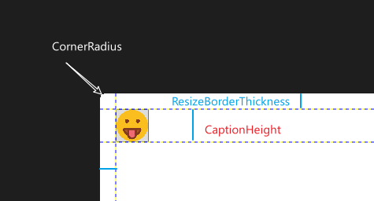

# Include font resources
- A font can be used by (1) specify the URI and the font name directly in `FontFamily` attribute. 
- Define the font as a resource and then use it as `StaticResource`. When creating the resource, the URI and the font name are specified.
The URI refers to the **folder** that contains the font file.
We can use relative or absolute pack URI in the XAML.


Also See this [doc](https://docs.microsoft.com/en-us/dotnet/api/system.windows.media.fontfamily?view=net-5.0#specifying-fonts-in-alternate-directories) for the above methods.

Note that, to embed the font into the assembly, the build action should be *Resource*. In this case, the `pack://application:,,,` authority must be used (or its relative version). We can also set the build action to `None` or `Content` and asks VS to copy the resources to the output folder. Then, use `pack://siteoforigin:,,,` to access them.

# `TextBlock` style `BasedOn`
The peculiarity of `TextBlock` is that it inherits `FrameworkElement` directly (rather than `Control`). Thus, a base style for `Control` cannot be inherited via `BasedOn` in a `TextBlock` style.
>InvalidOperationException: Can only base on a Style with target type that is base type 'TextBlock'

One solution is given [here](https://stackoverflow.com/questions/25586037/invalidoperationexception-can-only-base-on-a-style-with-target-type-that-is-bas), which defines a base style for `FrameworkElement` and uses attached property for `Setter`.

A possibly simple way is just to handle `TextBlock` separately.

# Borderless window

## Importance changes in newer .Net versions and WindowChrome
- Unlike the video tutorial, no need to install the NuGet package now. The `WindowChrome` class has been built-in after .Net 4.5. See (WindowChrome Class)[https://docs.microsoft.com/en-us/dotnet/api/system.windows.shell.windowchrome?view=net-5.0#definition] and the excellent explanation therein on how to customize the window.
`WindowChrome.WindowChrome` is an attached property.
- To bind a `Thickness`-like type to a *single* number, there is no need to define a converter nor to return a `Thickness` directly. There is `System.Windows.ThicknessConverter` after .NET 3.0. We can check its [source code](https://referencesource.microsoft.com/#PresentationFramework/src/Framework/System/Windows/ThicknessConverter.cs,4c4a0e5660ee993d) to confirm what kinds of types it supports.  For example,
```csharp
public override object ConvertFrom(ITypeDescriptorContext typeDescriptorContext, CultureInfo cultureInfo, object source)
{
    if (source != null)
    {
        if (source is string)      { return FromString((string)source, cultureInfo); }
        else if (source is double) { return new Thickness((double)source); }
        else                       { return new Thickness(Convert.ToDouble(source, cultureInfo)); }
    }
    throw GetConvertFromException(source);
}
```
which means any type can be converted to `double` can be used. 
- It seems that the `WindowChrome.CornerRadius` is reduced to zero automatically once the window is maximized. Thus, no need to follow the window to handle the maximization event.

The following figures shows the usage of common properties in [`WindowChrome`](https://docs.microsoft.com/en-us/dotnet/api/system.windows.shell.windowchrome?view=net-5.0).


## Clear `ResizeBorderThickness` when maximized
>The ResizeBorderThickness property specifies an invisible border around the outside of the application window that the user can click-and-drag to resize the window.

Normally, we may want to remove the resizing border area once the window is maximized, since it becomes useless. A natural choice is to apply a `Trigger` according to window state.
```xml
<Style TargetType="Window">
    <Style.Triggers>
        <Trigger Property="WindowState" Value="Maximized">
            <!--Not work here due to nested property-->
            <Setter Property="WindowChrome.WindowChrome.ResizeBorderThickness" Value="0"/>
            <Setter Property="Background" Value="AliceBlue"/>
        </Trigger>
    </Style.Triggers>
</Style>
```
However, the above code will not work because nested properties are not allowed in a `Trigger`. Thus, we have to observe the `Window.StateChanged` event and change the value in the view model that is bound to `ResizeBorderThickness`.

An alternative way is to change `ResizeBorderThickness` in the setter of the backing data bound to `Window.WindowState`.
```csharp
public WindowState WindowState
{
    get { return windowState; }
    set
    {
        Debug.WriteLine($"Window state => {value}");
        SetAndNotify(ref windowState, value);
        if (windowState == WindowState.Maximized)
            ResizeBorderThickness = 0;
        else
            ResizeBorderThickness = NormalResizeBorderThickness;
    }
}
```

## The `MouseDown` event of `Button` is not fired: used `PreviewMouseDown`
> Button suppresses MouseLeftButtonDown and MouseRightButtonDown bubbling events raised by the Button or its composite elements in favor of capturing the mouse and raising a Click event that is always raised by the Button itself. 

> But often a simpler technique is to change the routing direction you handle to be the Preview equivalent of an input event. 

Source: [Working Around Event Suppression by Controls](https://docs.microsoft.com/en-us/dotnet/desktop/wpf/advanced/preview-events?redirectedfrom=MSDN&view=netframeworkdesktop-4.8#working-around-event-suppression-by-controls)

## Code-behind is not evil and can benefit if properly used

View (UI state)-only logic, which is independent from the data (e.g., model), is recommended to be placed into the code-behind. In general, no data binding is really needed for such operations (though we may set up some unnecessary data bindings for view manipulation purposes). 

Refer to this stackoverflow [ using code-behind or viewmodel](https://stackoverflow.com/questions/42085063/mvvm-manipulating-the-view-using-code-behind-or-viewmodel).

Example: the window state change maximization/minimization etc. does NOT depend on the underlying data and is a pure view state manipulation according to user inputs. It is better to put this view logic into the code-behind to clean the view model.

### Change button image according to the window state
1. We may implement it in `Button.Click` or `Window.StateChanged` event
2. An issue with the above event handlers is that, if the window initial state is `Maximized`, then no event is raised. Thus, some kind of logic is also needed in `init`-like event. Alternatively, we may fix the initial state to `Normalized`.
3. A better approach is to apply data trigger: a `Trigger` has the capacity to restore its previous state automatically, and the initial state can also trigger (i.e., unlike an event).
```xml
<Button  x:Name="maxButton"
    Style="{StaticResource HoverlessButton}" Click="maximizeWindow">
    <Button.ContentTemplate>
        <DataTemplate>
            <Image x:Name="btnImage" Source="/Images/Buttons/max.png"/>
            <DataTemplate.Triggers>
                <DataTrigger Binding="{Binding RelativeSource={RelativeSource AncestorType={x:Type Window}}, Path=WindowState}"
                             Value="Maximized">
                    <Setter TargetName="btnImage" Property="Source" Value="/Images/Buttons/restore.png"/>
                </DataTrigger>
            </DataTemplate.Triggers>
        </DataTemplate>
    </Button.ContentTemplate>
</Button>
```
NOTE
- We cannot use `Trigger` (usually inside a `Style`) here because we need to access the property of another control (not the one associated with the template).
- The above code also shows that a `DataTemplate` may contain no bindings at all.


