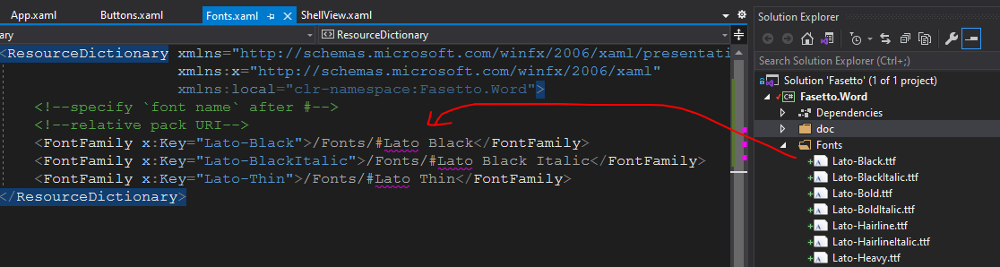

# Include font resources
- A font can be used by (1) specify the URI and the font name directly in `FontFamily` attribute. 
- Define the font as a resource and then use it as `StaticResource`. When creating the resource, the URI and the font name are specified.
The URI refers to the **folder** that contains the font file.
We can use relative or absolute pack URI in the XAML.

Also See this [doc](https://docs.microsoft.com/en-us/dotnet/api/system.windows.media.fontfamily?view=net-5.0#specifying-fonts-in-alternate-directories) for the above methods.

Note that, to embed the font into the assembly, the build action should be *Resource*. In this case, the `pack://application:,,,` authority must be used (or its relative version). We can also set the build action to `None` or `Content` and asks VS to copy the resources to the output folder. Then, use `pack://siteoforigin:,,,` to access them.