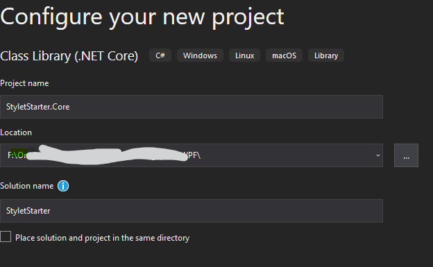

In this beginner tutorial, we try to reproduce step-by-step the introductory *GuestBook* example originally given by Tim Corey, a prominent tutor teaching .Net technology who has published quite a number of inspiring [tutorial videos on YouTube](https://www.youtube.com/channel/UC-ptWR16ITQyYOglXyQmpzw). For this specific example in this tutorial, the video given by Tim Corey is found [here](https://youtu.be/8E000zu8UhQ?list=PLm97Mr_WwOyk4ug4j4sRA4wyQShxGodyr&t=2124) (starting from 35:20). In that video, Tim Corey turns to the *MVVMCross* framework, since *Caliburn Micro* is no longer actively maintained now 😐. Nonethess, we will use arguably the  more convenient *Stylet* framework here (especially if you only target WPF rather than the mobile stuff with Xamarin🙂), 

Overall, this tutorial is a mirror of the one from Tim Corey except that MVVMCross is replaced with Stylet. Therefore, you are strongly recommended to check Tim Corey's video for many common steps and the rationality behind the code. The environment we work with is Visual Studio (VS) 2019, .Net Core 3.1, and *stylet* 1.3.4. 

----

# Preview of the application
A screenshot of the final WPF application *GuestBook* is shown below. 


A user inputs the first name and the last name of a guest. Then click the *Add* button to add a guest into the data grid below. We also want that 
- During the typing of the first/last name, the full name shown at the top is updated simultaneously.
- If nothing is typed for the first/last name yet, then the button is disabled.

In our code, a guest is to be modelled by a class `PersonModel` and a guestbook is just a collection of `PersonModel` instances. Note that, in this **toy** example, no data persistence (e.g., a database or a file) is applied.

We divide the solution into two projects to be consistent with Tim Corey's tutorial: one containing the models and the viewmodels, and the other including purely views. Ideally, the first project contains platform-independent sharable code and can be reused in multiple platforms (e.g., WPF, UWP, and mobile APPs). Of course, we only focus on WPF here.
Since *stylet* is a viewmodel-first framework, let's begin with the model and viewmodels.

-----

# 1. *StyletStarter.Core* project
## 1.0 Create a .Net Core class library project.
Following Tim Corey's convention, we first create a project (as well as solution in VS) for the model and viewmodel layers. 

In this creating new project step, select "Class Library (.NET Core)" as follows. The project name is *StyletStarter.Core*, but the solution name is *StyletStarter* (since we will add another project into this solution later).



After the project is created, delete the automatically generated *Class1.cs*.

## 1.1 Add the model class to *StyletStarter.Core*
As a convention, first create a folder *Models* inside the project. Now add a new class *PersonModel.cs* into *Models*. 

Copy or type the following code into your *PersonModel.cs*. This model is a simple class with only two properties. 

```csharp
using System;
using System.Collections.Generic;
using System.Text;

namespace StyletStarter.Core.Models
{
    public class PersonModel
    {
        public string FirstName { get; set; }
        public string LastName { get; set; }
    }
}
```
Note that the class modifier above should be `public` since the second WPF project will depend on this project later and `PersonModel` must be accessible outside its own assembly. Besides, the three `using` namespaces at the top are inserted by VS automatically and are actually unused here (you can remove them safely if you like).

## 1.2 Add the viewmodel class to *StyletStarter.Core*
Again, first add a new folder *ViewModels* and then place a *GuestBookViewModel.cs* class file inside it. To use the *Stylet* framework, a viewmodel is reccomended to inherit the [`Screen`](https://github.com/canton7/Stylet/wiki/Screens-and-Conductors) class. We thus first add the dependency on *Stylet*. 

Right click the "Dependencies" term under *StyletStarter.Core* project and choose "Manage NuGet Packages". Search for "Stylet" and install it.

Now the solution structure looks as follows.


The content of the file `GuestBookViewModel.cs` is given below.
```csharp
using Stylet;
using StyletStarter.Core.Models;

namespace StyletStarter.Core.ViewModels
{
    public class GuestBookViewModel : Screen
    {
        // a collection of models
        private BindableCollection<PersonModel> people = new BindableCollection<PersonModel>();

        public BindableCollection<PersonModel> People
        {
            get { return people; }
            set { SetAndNotify(ref people, value); }
        }


        // expose the properties of a model that can notify changes
        // if either firstName or lastName is changed, then the FullName is also changed.
        private string firstName;

        public string FirstName
        {
            get { return firstName; }
            set
            {
                // both methods below are inherinted from `PropertyChangedBase`
                SetAndNotify(ref firstName, value);
                NotifyOfPropertyChange(nameof(FullName));
                NotifyOfPropertyChange(nameof(CanAddGuest));
            }
        }


        private string lastName;

        public string LastName
        {
            get { return lastName; }
            set
            {
                SetAndNotify(ref lastName, value);
                NotifyOfPropertyChange(nameof(FullName));
                NotifyOfPropertyChange(nameof(CanAddGuest));
            }
        }

        public string FullName
        {
            get { return $"{FirstName} {LastName}"; }
        }


        // "Command" to be called by clicking the button
        public void AddGuest()
        {
            var p = new PersonModel { FirstName = this.FirstName, LastName = this.LastName };
            People.Add(p);
            // clear the two textboxes
            FirstName = string.Empty;
            LastName = string.Empty;
        }

        // Guard property for the `AddGuest` action: just a getter-only property (like `FullName`)
        // We use the "expression body" syntax introduced in C# 6.
        // The returned value controls whether the button is enabled. 
        public bool CanAddGuest => FirstName?.Length > 0 && LastName?.Length > 0;
    }
}
```
Some explanations of the above code.
- The `ObservableCollection` class is replaced with a more powerful subclass [`BindableCollection`](https://github.com/canton7/Stylet/wiki/BindableCollection) provided by *Stylet* (though we do not need the extra functionality it brings in this toy example).
- `Screen` is a subclass of `PropertyChangedBase`, which implements `INotifyPropertyChanged` interface. `Screen` provides a convenient method for us to raise the `PropertyChanged` event: simply call `SetAndNotify`. See its [documentation](https://github.com/canton7/Stylet/wiki/PropertyChangedBase) here.
- The property `FullName` depends on properties `FirstName` and `LastName`. Thus, if either is changed, a change notification should also be published for `FullName`. This is achieved using the `PropertyChangedBase.NotifyOfPropertyChange` method. The same principle applies to the `CanAddGuest` property.
- Unlike MVVM Cross and traditional WPF, *Stylet* introduces a more powerful *Command* mechanism through *Actions*. The apparent advantage is that there is no need to declare explicitly an `ICommand`-like object (you can see that in Tim Corey's video using MVVM Cross 😸). 
- A guarding mechanism is also provided by *stylet* to determine whether an action (command) is enabled: simply define a property named "Can[method name]", like the `CanAddGuest` here. Check the [`Actions`](https://github.com/canton7/Stylet/wiki/Actions) page for more details.

----------
# 2. *StyletStarter.Wpf* project
To avoid writing boilerplate code, we use the template provided by *Stylet* to generate a new WPF project. The instructions are documented on [Quick Start page](https://github.com/canton7/Stylet/wiki/Quick-Start). Recall that we are targeting .Net Core, a natural choice particually in 2020.

## 2.0 Add a .Net Core WPF project
In VS, right click the Solution "StyletStarter" and choose "Open in Terminal". An integrated terminal window is opened inside VS. Following the above instructions, first type the following command to install the *stylet* template
```powershell
dotnet new -i Stylet.Templates
```
and then create a new project *StyletStarter.Wpf* by entering
```
dotnet new stylet -o StyletStarter.Wpf
```
It says "The template "Stylet Application" was created successfully." if nothing is wrong. However, you probably see that nothing changed in VS, and the solution still has one project. Don't worry. If you check the solution folder in file explorer, it is clear that a new folder *StyletStarter.Wpf* has indeed been created. Now right click Solution "StyletStarter" and select "Add -> Existing Project". Next choose the *StyletStarter.Wpf.csproj* project inside the *StyletStarter.Wpf* folder. 

(Of course, the above two commands can be executed in any terminal outside VS, like the CMD, PowerShell, or Windows Terminal, etc. Just make sure that the root directory is correct, i.e., the one containing the VS solution file.)

Right click the added *StyletStarter.Wpf* project and set it as a Startup Project. Now you can start the program to confirm that everying is fine. An empty *Stylet* app shows up with a line of text "Hello Stylet!".

Note that the dependency of the project *StyletStarter.Wpf* on *Stylet* has already been added with the above template generation. Now we simply need to add dependency on our previous *StyletStarter.Core* project. Right click "Dependencies" of the *StyletStarter.Wpf* project and choose "Add Project Reference". Now the solution structure looks like


😢😢😢**Two more steps for the current version of Stylet (v1.3.4)**

- Currently (20/11/2020) the project generated by the *Stylet* template still targets .Net Core 3.0 by default. Since our first .Net library project targets .Net Core 3.1,  you may see that VS complains
> Error	NU1201	Project StyletStarter.Core is not compatible with netcoreapp3.0 (.NETCoreApp,Version=v3.0). Project StyletStarter.Core supports: netcoreapp3.1 (.NETCoreApp,Version=v3.1)

If so, then right click the project *StyletStarter.Wpf* and change its target framework to ".NET Core 3.1". Everything is fine again 🛩️.

- The default namespace generated by the template is `Company.WpfApplication1` rather than the desired `StyletStarter.Wpf`. We could have specified the namespace we want by `-n` option when running the second template command above. However, the current *Stylet.Templates 1.3.4* has some bugs and this syntax does not work yet. (It has been fixed in the *develop* branch though.) Thus, we have to change the namespace manually by replacing all `Company.WpfApplication1`  with `StyletStarter.Wpf` as follows.


It is hopeful that the above two steps will be no longer required once the next version of *Stylet* is published.

😃😃😃

## 2.1 Design the GUI in XAML
In the generated *StyletStarter.Wpf* project, the `ShellViewModel` is the root viewmodel of the application. As the name implies, the corresponding `ShellView` acts as a shell that contains every other view in our application.

For a toy application with a single window, we can actually use the `ShellView` as the main window and put various controls there. However, in any practical non-trivial application, we typically have multiple views. Hence, we continue to design a separate view for the `GuestBookViewModel`, named `GuestBookView`. Please refer to the beginning of this tutorial for an overview of the GUI, which is composed of `TextBlock`, `TextBox`, `Button`, and `DataGrid`.

Now create a folder *Views* and add a "User Control (WPF)" in VS. The new file name is of course *GuestBookView*. A XAML file *GuestBookView.xaml* and its code-behind file are added. 

To use *Stylet*, we first add its namespace into the XAML file by `xmlns:s="https://github.com/canton7/Stylet"`. Next, put a `StackPanel` and other related controls. The complete *GuestBookView.xaml* is pasted below.

```xml
<UserControl x:Class="StyletStarter.Wpf.Views.GuestBookView"
             xmlns="http://schemas.microsoft.com/winfx/2006/xaml/presentation"
             xmlns:x="http://schemas.microsoft.com/winfx/2006/xaml"
             xmlns:mc="http://schemas.openxmlformats.org/markup-compatibility/2006" 
             xmlns:d="http://schemas.microsoft.com/expression/blend/2008" 
             xmlns:local="clr-namespace:StyletStarter.Wpf.Views"
             xmlns:s="https://github.com/canton7/Stylet"
             mc:Ignorable="d" 
             d:DesignHeight="450" d:DesignWidth="800">
    <StackPanel Margin="10">
        <TextBlock Text="{Binding FullName}" FontSize="28" Margin="0,0,0,15"/>
        <TextBlock Text="First Name"/>
        <TextBox Text="{Binding FirstName, Mode=TwoWay, UpdateSourceTrigger=PropertyChanged}" Margin="0,0,0,15"/>
        <TextBlock Text="Last Name"/>
        <TextBox Text="{Binding LastName, Mode=TwoWay, UpdateSourceTrigger=PropertyChanged}" Margin="0,0,0,15"/>
        <Button Margin="0,0,0,15" Command="{s:Action AddGuest}">Add Guest</Button>
        <DataGrid ItemsSource="{Binding People}" AutoGenerateColumns="True"></DataGrid>
    </StackPanel>
</UserControl>
```
Note that 
- The core bridge between a view and a viewmodel in MVVM is data binding. We have exposed relevant properties, which can inform their own changes, in `GuestBookViewModel`. In the above XAML, we bind the controls' (dependency) properties to the exposed properties of the viewmodel.
- The only part specific to *Stylet* is the `Command="{s:Action AddGuest}"` that depends on its [Action](https://github.com/canton7/Stylet/wiki/Actions) mechanism. There is also a hidden feature, [guard property](https://github.com/canton7/Stylet/wiki/Actions#guard-properties), that determines whether the command `AddGuest` can be executed by checking the property `CanAddGuest`.

## 2.2 Place the custom view into the shell view
After we finish the `GuestBookView`, the next step is to *place* it inside the shell `ShellView`. In *stylet*, it is usually (also reccomended) implemented using the `Conductor`. Nonetheless, for our single-window toy example, we will follow a simpler way without using conductor for now. 

### 2.2.1 Put a `ContentControl` in `ShellView` to render `GuestBookView`

Stylet's architecture is built on a [ViewModel-First](https://github.com/canton7/Stylet/wiki/ViewModel-First) basis. To put it simple, we simply `new` a ViewModel in the program, and *stylet* will locate autonomously the View for it and show the view accordingly. How can *stylet* find a view if we do not tell it explicitly? It is nothing magic 😆: a naming convention is adopted.
> The default implementation uses naming conventions to locate the correct View for a given ViewModel, replacing 'ViewModel' with 'View' in its name. 

That convention is respected in most MVVM frameworks. For instance, our viewmodel is `GuestBookViewModel`, and the corresponding view is called `GuestBookView`.

In the ViewModel-First approach, a viewmodel may *own* another viewmodel, which makes it straightforward to compose viewmodels, a big advantage of *stylet*. Let's begin!

First insert a new property `Content` (or any name you like 😹) into `ShellViewModel`, which refers to an instance of `GuestBookViewModel`. 
```csharp
using Stylet;
using StyletStarter.Core.ViewModels;

namespace StyletStarter.Wpf.Pages
{
    public class ShellViewModel : Screen
    {
        public ShellViewModel()
        {
            Content = new GuestBookViewModel();
        }

        public GuestBookViewModel Content { get; private set; }
    }
}
```
You may notice that we did not raise a property changed event for the above `Content` property. The main reason is that we do not need it here, because in this toy application the view (and thus the viewmodel) will never be changed.

Next, we place a `ContentControl` in `ShellView` to show our `GuestBookView`. Then, the `View.Model` attached property provided by *stylet* is used to specify the underlying viewmodel in `ContentControl`. The source of `ShellView.xaml` becomes now
```xml
<Window x:Class="StyletStarter.Wpf.Pages.ShellView"
        xmlns="http://schemas.microsoft.com/winfx/2006/xaml/presentation"
        xmlns:x="http://schemas.microsoft.com/winfx/2006/xaml"
        xmlns:d="http://schemas.microsoft.com/expression/blend/2008"
        xmlns:mc="http://schemas.openxmlformats.org/markup-compatibility/2006"
        xmlns:s="https://github.com/canton7/Stylet"
        xmlns:local="clr-namespace:StyletStarter.Wpf.Pages"
        mc:Ignorable="d"
        d:DataContext="{d:DesignInstance local:ShellViewModel}"
        Title="Stylet Project" Height="450" Width="800">
    <ContentControl s:View.Model="{Binding Content}"/>
</Window>
```
Upon closer inspection, we see that the `DataContext` of `ShellView` is an instance of `ShellViewModel`. Thus, the binding below (without explicit source) takes the `ShellViewModel` instance as its data source and binds to the property `Content` that we have defined above. In a word, *stylet* works as follows
>The `View.Model` attached property will fetch the ViewModel it's bound to (in this case it's an instance of `GuestBookViewModel`), and locate the correct view (`GuestBookView`). It will instantiate an instance, and set it as the content of that `ContentControl`.

## 2.2 Namespace transformation

It seems that we have finished the application. Let's start the program by pressing F5. Oops! An exception is thrown:


Why cannot *stylet* find the view for our `GuestBookViewModel`? The error message says "Unable to find a View with type StyletStarter.Core.Views.GuestBookView". Now it should become clear: our actual `GuestBookView` resides in a different namespace `StyletStarter.Wpf.Views`. However, by default, as stated in the [ViewManager](https://github.com/canton7/Stylet/wiki/The-ViewManager) page
>The default view-location strategy is pretty simple: replace the string "ViewModel" with the string "View" in the type and namespace of the ViewModel

Apparently, our namespaces do not follow the above default rule. Don't worry. We can tell *stylet* a custom namespace transformation rule, which is explained in [Configuring the ViewManager](https://github.com/canton7/Stylet/wiki/The-ViewManager#configuring-the-viewmanager). We simply override the `Configure` method of `Bootstrapper` class as follows
```csharp
protected override void Configure()
{
    // Perform any other configuration before the application starts
    var viewManager = this.Container.Get<ViewManager>();
    viewManager.NamespaceTransformations.Add("StyletStarter.Core.ViewModels", "StyletStarter.Wpf.Views");
}
```
which locates views in the namespace `StyletStarter.Wpf.Views` for viewmodels present in a different namespace `StyletStarter.Core.ViewModels`.

As a reminder, if your view and viewmodel namespaces satisfy the default rule already, e.g., views and viewmodels in a single project, then no custom transformation is needed.

## Finally...
Now start the application again and it should run normally. Get yourself a coffee and play with the App 👍.


The final solution structure is 


# 3. Advanced techniques in *stylet*

## 3.1 Conductor and viewmodel lifecycle management
What is a conductor? The concept may be a little abstract until you play with it. In short,
> A Conductor is, simply, a ViewModel which owns another ViewModel, and knows how to manage its lifecycle.

In our guest book application, there is essentially only one viewmodel, and no lifecycle issue is involved. That is, the unique viewmodel `GuestBookViewModel` (and its view `GuestBookview`) is created at the beginning and disposed (closed) at the end of the application. Nevertheless, if you have multiple viewmodels, their creation, activation, and closing must be managed properly. That is why we need a `Conductor`. Detailed documentation is on the [Screens and Conductors](https://github.com/canton7/Stylet/wiki/Screens-and-Conductors) page. 

Now suppose we want to manage the lifecycle of our `GuestBookViewModel` (which is in fact not necessay in this toy example though). Since there is only one viewmodel, we use the built-in conductor [`Conductor<T>`](https://github.com/canton7/Stylet/wiki/Screens-and-Conductors#conductort), where `T` refers to the type of the viewmodel to be managed.

We can make the `ShellViewModel` inherit `Conductor<Screen>`, since by convention every viewmodel in a *stylet* application is a subclass of `SCreen`. Now the `ShellViewModel` becomes a `Conductor` now and can manage the internal `GuestBookView`. 

In *ShellViewModel.cs* we have the following code, in which the `ActiveItem` of a conductor is initialized to an instance of `GuestBookViewModel`.
```csharp
using Stylet;
using StyletStarter.Core.ViewModels;

namespace StyletStarter.Wpf.Pages
{
    public class ShellViewModel : Conductor<Screen>
    {
        public ShellViewModel()
        {
            ActiveItem = new GuestBookViewModel();
        }
    }
}
```
Accordinly, we need to reset the `ContentControl` of `ShellView` to make its Content bind to the `ActiveItem`. That is, change that specific line in *ShellView.xaml* to 
```xml
<ContentControl s:View.Model="{Binding ActiveItem}"/>
```

Now run the program again. As expected, everything works as before. Finally, note that, though not required in this toy example, the `Conductor` is a powerful tool to manage and to coordinate the lifecyle of one or more viewmodels. For instance, you may change its `ActiveItem` (a viewmodel) by calling `ActivateItem(T item)`, which causes the changes of views accordingly. This technique is commonly used in tab-like interfaces. Please check [Conductors in Detail](https://github.com/canton7/Stylet/wiki/Screens-and-Conductors#conductors-in-detail).


